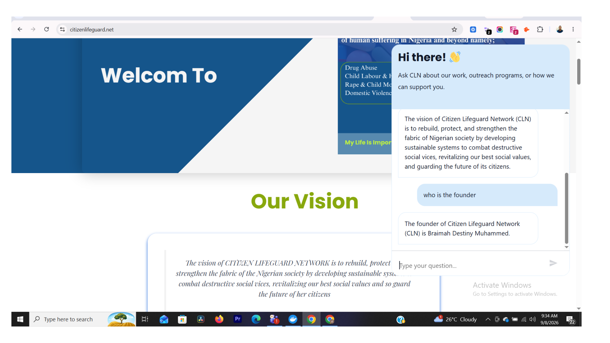
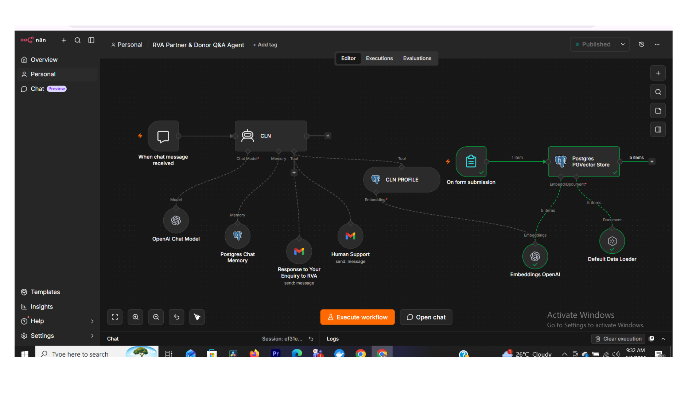

# CLN Partner & Donor Q&A Agent

An AI agent built in n8n, live and deployed on [Citizen Lifeguard Network's](https://citizenlifeguard.net) website, answering real questions from visitors, partners, and donors about the organization's mission, programs, and how to get involved.

## What it does

This is a retrieval-augmented generation (RAG) agent embedded directly as a chat widget on a real nonprofit's homepage. When a visitor asks a question, the agent retrieves accurate information from the organization's actual reference documents and responds conversationally, grounded in real content rather than generic or hallucinated answers.

**Example (screenshot below):** A visitor asked "what is the vision of CLN" on the live site, and the agent responded with CLN's actual stated vision, word for word matching the organization's own published mission language.

## Architecture

- **Trigger:** Chat message received from the embedded website widget
- **Agent:** Custom "CLN" agent powered by an OpenAI chat model
- **Memory:** Postgres-based chat memory, so the agent keeps context across a conversation instead of treating every message as new
- **Knowledge base:** Reference documents (mission, programs, history) ingested through a document loader, chunked, converted to embeddings via OpenAI, and stored in a Postgres PGVector store for semantic search
- **Human handoff:** If a question needs a real person, the agent can escalate by sending an email enquiry directly to the RVA/CLN team, so visitors aren't left stuck with an AI-only answer
- **Knowledge updates:** A form-based upload flow lets new documents be added to the knowledge base, which get embedded and stored the same way as the original reference material

## Why I built it

I wanted to build something beyond a personal demo, an agent actually solving a real communication problem for a real organization. Citizen Lifeguard Network is a nonprofit I'm personally involved with, focused on child labor, domestic violence, and drug abuse awareness in Nigeria. This agent lets partners and donors get accurate answers instantly instead of waiting on email replies, while still routing genuinely complex questions to a real person.

## Proof it works

Live on the site right now: [citizenlifeguard.net](https://citizenlifeguard.net)

## Workflow architecture

## Built with

n8n · OpenAI · Postgres · PGVector
